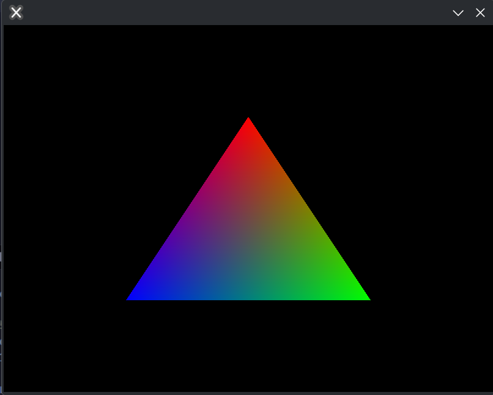

# vkapi

Cross-platform low level Vulkan bindings for LuaJIT.

## Installation

```bash
lpm add vkapi --git https://github.com/codebycruz/vkapi
```

## Example

You can find an example rendering a triangle in [examples/triangle](examples/triangle)



## Documentation

Currently there is no documentation, as the api is quite similar, if not identical to the [Vulkan API](https://docs.vulkan.org/spec/latest/index.html), beyond a few changes in the way things are named. Everything is in camelCase, enums are still in SCREAMING_SNAKE_CASE but may have redundant prefixes, ie VK\* or suffixes, ie \_BIT, removed.

A few examples might give you the gist:

`VkCreateInstance` -> `vk.createInstance`
`VkCreateBuffer` -> `VkDevice:createBuffer`
`VkQueueFlagBits.GRAPHICS_BIT` -> `vk.QueueFlagBits.GRAPHICS`
